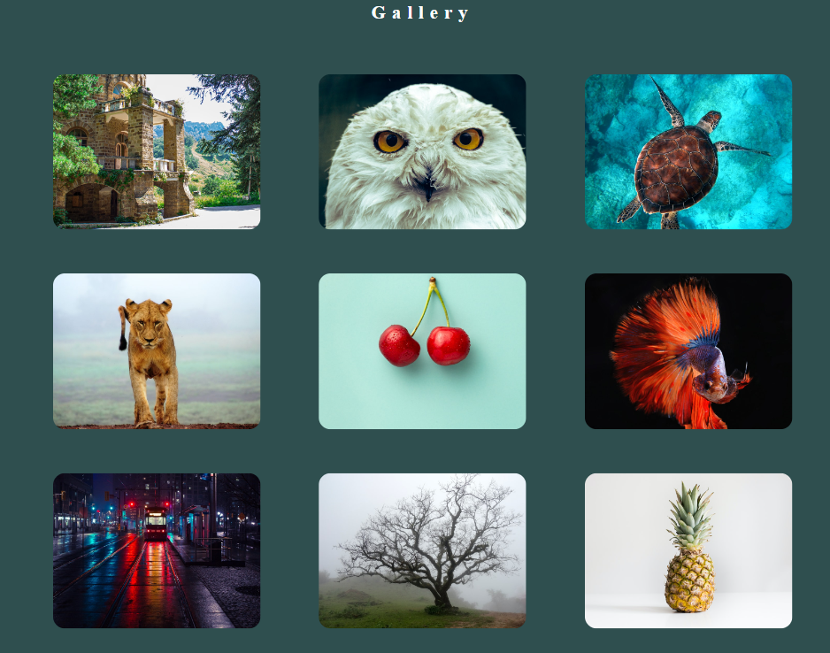

# React Gallery Mini Project

- Create React App using Vite Boilerplate
  - npm create vite@latest projectname
  - npm install
  - npm run dev

## Images Rest Api

    - https://api.slingacademy.com/v1/sample-data/photos

## Additional Libraries

- Axios => For Api
- react-router-dom => For Routing

## Demo

